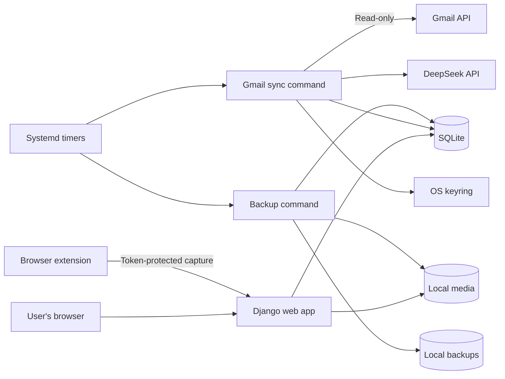
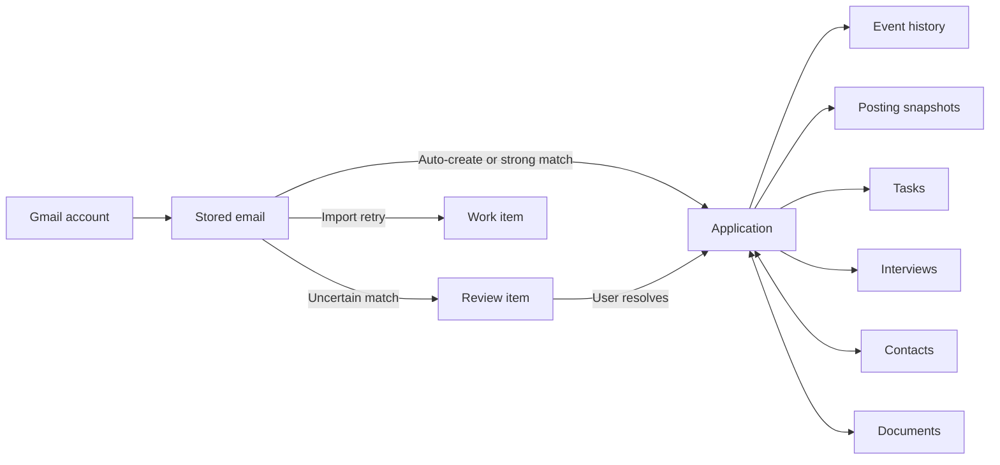
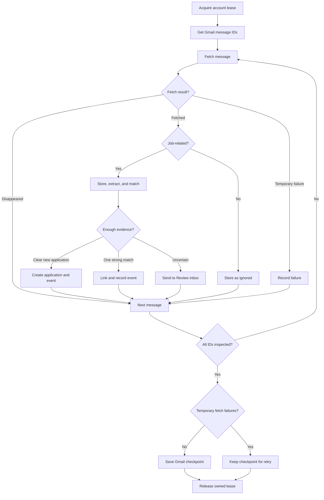

# Job Application Monitor — Project Guide

This guide explains the repository from first principles for someone who has not seen the codebase before.

## 1. Purpose and operating model

Job Application Monitor is a private, single-user web application that runs on the user's Linux computer. It answers four practical questions:

1. Which opportunities exist, and what stage is each one in?
2. What changed recently in Gmail?
3. What needs attention next?
4. What did the original posting require, even if the source page later disappears?

Manual records remain authoritative. Gmail and AI reduce data entry, but automatic changes are deliberately conservative: strong evidence can update a record, uncertain evidence enters Review, older messages cannot regress a newer stage, and user-corrected stage values are protected.

This is not a hosted multi-user service, application-submission bot, email sender, or two-way calendar system. It does not scrape logged-in social sites or infer rejection from silence.

## 2. Technology and process architecture

The runtime has three local processes or entry points:

- **Web application:** Django serves authenticated, server-rendered pages on `127.0.0.1:8765`.
- **Gmail sync job:** `manage.py gmail_sync --all` runs as an idempotent, short-lived worker approximately every five minutes.
- **Backup job:** `manage.py backup --keep 7` creates a consistent SQLite/media archive daily.

The browser extension is a separate Manifest V3 client for Chrome, Brave, and other Chromium browsers. It reads the active tab only after the user clicks it, extracts visible/structured posting data, and submits that data to a token-protected loopback endpoint. Brave uses the same extension package; maintaining a second Brave-specific copy would add drift without adding capability.

Persistent state is intentionally simple:

- SQLite with WAL mode for relational state.
- `data/media/` for uploaded documents.
- `data/backups/` for full local archives.
- `data/ai_usage/` for the append-only monthly AI-cost ledger.
- OS keyring for Gmail refresh tokens and, optionally, the DeepSeek API key.

External services are limited to the Gmail API, Google OAuth, and the configured OpenAI-compatible DeepSeek endpoint. The application does not require Redis, a task queue, containers, a cloud database, or a separate frontend build.



## 3. Repository structure

```text
.
├── config/
│   ├── settings.py          Django/runtime/security configuration
│   ├── urls.py              Admin, auth, tracker, and protected media routes
│   ├── asgi.py              ASGI entry point
│   └── wsgi.py              WSGI entry point
├── tracker/
│   ├── models.py            Entire relational data model
│   ├── views.py             HTTP/UI endpoints and request validation
│   ├── forms.py             Application, task, interview, contact, and filter forms
│   ├── services.py          Events, stage changes, documents, snapshots
│   ├── sync.py              Gmail import, extraction, retries, locks, checkpoints
│   ├── matching.py          Evidence matching and forward-only decisions
│   ├── review.py            Review-inbox resolution
│   ├── capture_service.py   Posting persistence and AI enrichment
│   ├── reminders.py         Follow-up candidates, drafts, task creation
│   ├── reports.py           Cohorts, milestones, rates, response times
│   ├── backup.py            Backup, integrity verification, restore, CSV rows
│   ├── middleware.py        Per-request display timezone
│   ├── integrations/
│   │   ├── gmail.py         OAuth, Gmail reads, MIME/body handling
│   │   ├── extract.py       Prompts, validation, normalized extraction objects
│   │   ├── ai_client.py     DeepSeek client, JSON parsing, cost ceiling
│   │   ├── capture.py       Safe URL retrieval and JobPosting parsing
│   │   ├── secrets.py       Keyring and Gmail-account registry
│   │   ├── benchmark.py     Fixture extraction benchmark
│   │   └── validate_real.py Real-account sampling/validation helper
│   ├── management/commands/ Operational command-line entry points
│   └── migrations/          Django schema history
├── templates/               Base layout and tracker pages/partials
├── static/                  Shared CSS and vendored local HTMX
├── extension/               Chrome/Brave (Chromium) popup and active-tab extractor
├── scripts/                 Launcher and systemd services/timers
├── fixtures/                Synthetic email and posting examples
├── tests/                   Behavior and regression tests
├── .env.example             Configuration template
├── pyproject.toml           Runtime/dev dependencies and tool settings
├── uv.lock                  Reproducible dependency lock
└── IMPLEMENTATION_PLAN.md   Product scope and completion criteria
```

Runtime files under `data/`, `.env`, OAuth client files, databases, and media are ignored by source control.

## 4. Data model

All records live in `tracker/models.py`.

### Application

The central opportunity record. It stores company/title identity, job and requisition identifiers, source, location/work arrangement, employment/salary details, dates, priority, stage, notes, tags, archive state, and manually overridden fields. Related records supply history and operational detail.

### GmailAccount and Email

`GmailAccount` stores account identity, import window, history cursor, backfill state, connection state, last successful sync, lock heartbeat, and last error. Credentials are not stored here.

`Email` stores a unique `(account, message_id)` record, thread and header metadata, inert text content, AI output, versioned content hash, processing state, and an optional application link. Imported emails survive Gmail deletion and deleting an email is never used to delete an application.

Application pages show each linked email's stored body in a collapsible section. Subject links open the Gmail thread using a best-effort web URL; Gmail's API does not provide an official web-view link, so the local body remains available if Gmail routing changes or the source message is deleted.

### ApplicationEvent and ReviewItem

`ApplicationEvent` is the auditable history: event type, source, actor, source email, summary/details, confidence, correction flag, effective time, import time, and a globally unique idempotency key when appropriate.

`ReviewItem` is one unresolved AI/matching decision. It preserves the suggestion, candidate applications, reason, resolution, and final application link.

### PostingSnapshot

An immutable, dated version of a posting. It preserves the original/resolved URL, source, title/company/identifier, readable description, structured requirements, explicit unknown fields, capture state, error information, and a content hash. A recapture creates a new version rather than mutating the old one.

### Task, Interview, Contact, Document

- `Task` supports application-linked or standalone work, due/snooze/completion timestamps, and notification state.
- `Interview` stores round, format, start/end, original timezone label, participants, location/meeting URL, preparation notes, notes, and outcome.
- `Contact` can be shared across applications and stores recruiter/interviewer details.
- `Document` is a managed local file, deduplicated by SHA-256 and linked to any number of applications. Its kind and user label identify resume/cover-letter versions.

### WorkItem and AppSettings

`WorkItem` persists retryable email extraction with attempts, backoff time, error, and status. `AppSettings` is a singleton for display timezone, import/follow-up defaults, AI model and ceiling, and the hashed extension pairing token.

The application is the hub; an email may remain unlinked while it waits in Review.



## 5. Main application flows

### Manual application flow

1. The user creates an application through `ApplicationForm`.
2. The view saves the application and records a user-authored creation event.
3. Later edits mark changed fields as manual overrides.
4. A stage change records both the current stage and an immutable history event.
5. Archive hides the application from normal lists without deleting its history.

The Applications table searches application fields plus stored posting descriptions and requirements. It supports company, role, stage, source, application date, location, work arrangement, priority, tag, archive, and ordering filters. The Board uses the same filtered query when filter parameters are supplied. Board cards can be dragged between all stages, including Rejected and Withdrawn; each card also has a Move to control for keyboard and touch use. Both paths record a user stage change through the same service.

### Gmail connection and backfill

1. `gmail_connect` starts Google's Desktop OAuth flow with the read-only Gmail scope.
2. The refresh token is stored in the OS keyring; the email address is registered in the configured data directory.
3. Settings can preview the count produced by the sender/subject/date query.
4. First sync records a safe history checkpoint before listing messages.
5. A capped backfill imports only unseen IDs and leaves the cursor incomplete until every listed ID has been inspected. Repeated runs therefore cannot skip the rest of a large mailbox.
6. Messages that pass the Gmail query but fail the local candidate check are stored as ignored, so a capped import can still make forward progress without sending them to AI.

The default search covers inbox, archived, and sent mail. Gmail's normal search excludes Spam and Trash unless explicitly requested; this application does not request them.

### Incremental Gmail sync

1. A database compare-and-set acquires one lock per Gmail account. A heartbeat prevents a long active import from being mistaken for a stale lock.
2. Due retry work is scoped to that account.
3. Gmail `history.list` is paginated from the stored cursor and returns message IDs plus the response checkpoint.
4. Each new message is fetched, cheaply filtered, stored idempotently, extracted, matched, and applied inside a short database transaction.
5. The response checkpoint is saved only after every non-disappeared message was fetched successfully.
6. On failure, the cursor stays unchanged, the lock is released, and `last_sync_at` remains the time of the last successful run.
7. If Gmail reports an expired history cursor, the worker performs a bounded rescan from the last successful sync and relies on message/event uniqueness to deduplicate it.

The management command continues to other configured accounts if one account fails, then exits non-zero so systemd records the run as failed.



### AI extraction and decision policy

The local filter avoids unnecessary requests. Quoted reply history is stripped and relevant message fields/body are sent to the model with a strict JSON schema. Parsed values are normalized and invalid event types or malformed responses are rejected.

A versioned SHA-256 content hash reuses a validated prior extraction for identical content. The version prefix makes prompt/schema changes invalidate the cache without a migration.

Matching order is intentionally strict:

1. exact requisition ID;
2. exact normalized job URL;
3. Gmail thread continuity within the same account;
4. company plus exact title only as a weak review suggestion.

Automatic creation is limited to clear application confirmations with company, role, sufficient confidence, and no review flag. Updates require one strong match. Manual stage corrections block later automatic stage writes, and older events are recorded without regressing the current stage. Extracted contacts and unambiguous invitation timestamps create related contact/interview records; uncertain times remain in Review.

AI usage is appended to a monthly JSONL ledger. The configured ceiling is checked before a request. Cost calculations are calibrated to the repository's default DeepSeek model and configured rate constants.

### Review inbox

The Review inbox shows source email evidence, extracted fields, candidates, and the reason automation stopped. A user can accept the one strong suggestion, explicitly link another application, create a new application, ignore a message, or resolve compatible groups in bulk.

Resolution is transactional. Confirming an imported stage does not mark the stage as a permanent manual override; an explicit application edit does.

### Posting archive

Public URL capture applies a strict safety chain before network access: HTTP(S) only, job-like host/path, blocked action/tracking paths, DNS resolution, public-address enforcement on every redirect, redirect/body/time limits, and HTML content validation.

Extraction prefers schema.org `JobPosting` JSON-LD, then readable page text. AI enrichment fills only absent requirement fields; structured source data wins. Failed or login-only pages are returned as explicit failures and are not persisted as successful snapshots.

The user can also paste the description on an application page. The Chrome/Brave extension extracts structured data or visible text from the active tab and submits an editable title/company preview through a revocable token. Original PDFs or screenshots can be retained as linked `Other` documents.

### Daily workflow and reports

Today combines due tasks, upcoming work/interviews, follow-up candidates, recent history, missing snapshots, and Gmail health. Browser notification permission is requested only after the user chooses **Enable task alerts**; local daily IDs prevent repeat alerts.

Follow-up suggestions apply only to submitted applications past the configured interval that have no open/snoozed task. Creating the suggestion is idempotent. Drafts are copy-only and never sent automatically.

Interviews can be edited/rescheduled/cancelled and exported as escaped calendar text. Reports distinguish current stage from historical milestones. Interview and offer rates use submitted applications as the common denominator; response time excludes acknowledgments and reports its sample and pending counts.

## 6. HTTP/UI surface

The principal routes are:

- `/` Today
- `/applications/` table and filters
- `/board/` pipeline board
- `/applications/<id>/` full application detail
- `/tasks/`, `/documents/`, `/reports/`, `/review/`, `/settings/`
- `/api/capture/` token-authenticated extension endpoint
- `/admin/` Django administration for advanced local repair

Django's login-required middleware protects all routes by default. The capture API is the only login-exempt tracker endpoint; it is POST-only, CSRF-exempt by necessity, and authenticates a random token using a constant-time hash comparison. Source email and posting content is rendered as escaped inert text.

## 7. Configuration and secrets

Copy `.env.example` to `.env`. Supported environment variables are:

| Variable | Default | Purpose |
| --- | --- | --- |
| `JOBMON_DATA_DIR` | `<repo>/data` | Database, media, usage ledger, account registry, backups |
| `DJANGO_SECRET_KEY` | insecure development value | Session/signing secret; replace before routine use |
| `DJANGO_DEBUG` | `1` | Django debug mode; use `0` for normal background operation |
| `DJANGO_ALLOWED_HOSTS` | `127.0.0.1,localhost` | Accepted Host headers; keep loopback-only |
| `DISPLAY_TIMEZONE` | `Africa/Cairo` | Initial presentation timezone; editable in Settings |
| `GOOGLE_OAUTH_CLIENT_SECRETS` | `credentials.json` | Google Desktop OAuth client JSON path |
| `DEEPSEEK_API_KEY` | unset | AI API key; OS keyring is the preferred alternative |
| `DEEPSEEK_BASE_URL` | `https://api.deepseek.com` | OpenAI-compatible endpoint |
| `AI_MODEL` | `deepseek-flash` | Initial model; editable in Settings |
| `AI_MONTHLY_CEILING_USD` | `10` | Initial recorded-spend ceiling; editable in Settings |
| `GMAIL_DEFAULT_HISTORY_DAYS` | `90` | Initial account backfill window |
| `JOBMON_HOST` | `127.0.0.1` | `scripts/run.sh` bind address; do not expose publicly |
| `JOBMON_PORT` | `8765` | Launcher port; extension expects 8765 |

`AppSettings` values take precedence for editable runtime preferences after the singleton is created. Changing an environment default does not overwrite an existing setting row.

Secrets and private data:

- Prefer `python -m tracker.integrations.secrets set-deepseek-key` for the AI key.
- Gmail OAuth refresh tokens always use keyring.
- `.env`, OAuth JSON, `data/`, databases, and media are ignored by Git.
- Use full-disk encryption and encrypted/off-device backup storage if local confidentiality matters.
- Run `chmod 700 data` and `manage.py security_check` after setup.

## 8. Install, run, build, and test

### Install

```bash
uv sync --dev
cp .env.example .env
uv run python manage.py migrate
uv run python manage.py create_local_user
```

There is no JavaScript build step. HTMX is vendored under `static/js/`, and the extension loads directly from `extension/`.

### Run interactively

```bash
./scripts/run.sh
```

The script backs up an existing database, applies migrations, and starts the loopback server without the development auto-reloader.

### Test and validate

```bash
uv run pytest -q
uv run ruff check .
uv run ruff format --check .
uv run python manage.py check
uv run python manage.py makemigrations --check --dry-run
uv run python manage.py security_check
node --check extension/popup.js
node --test tests/test_board_scroll.js
bash -n scripts/run.sh
```

The automated suite uses synthetic fixtures and temporary databases. It covers matching, extraction validation, duplicate replay, cursor expiry/failure, capped backfill continuation, AI cache reuse, review actions, URL safety, snapshot persistence, task/interview flows, report denominators, API authentication, security checks, and complete restore behavior.

### Local deployment with systemd

Copy `scripts/job-monitor.service`, `scripts/job-monitor-sync.*`, and `scripts/job-monitor-backup.*` to `~/.config/systemd/user/`. Adjust `WorkingDirectory` and the `uv` executable path if the checkout differs, reload systemd, then enable the web service and both timers. The exact commands are in the README.

This is a local deployment, not a public internet deployment. Django's built-in server is acceptable only for this authenticated loopback use. Do not change the bind address or proxy it publicly without replacing the server, adding HTTPS, reviewing trusted origins/cookies, and performing a new threat assessment.

## 9. Backup, restore, export, and recovery

### Backup

The Settings button or `manage.py backup --keep 7` uses SQLite's online backup API, copies media, writes a SHA-256 manifest, and prunes old archives. It never includes keyring credentials.

### Restore

Stop the web and sync units first. `manage.py restore <backup-directory>` validates the manifest hash and SQLite integrity, stages both database and media, swaps them into place, removes stale WAL/SHM files, and clears stale live media when the backup contains none. A failed database replacement restores the prior media directory.

Reconnect Gmail and restore/re-enter the AI key after moving a backup to another computer.

### CSV

Settings and `manage.py export_csv` produce a reporting/interchange summary. CSV omits event provenance, emails, snapshots, files, and settings, so it is never a substitute for a full backup.

### Failed extraction

Transient extraction failures create retry work with exponential backoff. Settings or `gmail_retry_failed` can retry already-stored failures without Gmail access. If old imported messages have missing dates, `repair_email_dates` can retrieve Gmail metadata and repair related event/application dates.

## 10. Important design decisions and dependencies

- **Local monolith:** simplest reliable architecture for one user and one machine.
- **SQLite WAL:** concurrent reads and short web/worker writes without database administration.
- **Server-rendered UI:** no client state store, API duplication, or frontend build pipeline.
- **Conservative automation:** evidence and identity rules authorize writes; confidence alone does not.
- **Review instead of guessing:** ambiguous identity, conflicts, and uncertain event details stay visible.
- **Current state plus immutable history:** current stage is convenient; events preserve provenance and corrections.
- **Content-addressed reuse:** document hashes deduplicate storage and versioned email hashes avoid duplicate AI expense.
- **Immutable snapshots:** preserves historical posting truth and makes recapture auditable.
- **Systemd timers:** reliable enough on Linux without a resident queue worker.
- **Native platform features:** HTML date/time inputs, `.ics` download, CSS responsiveness, and browser Notifications keep the dependency surface small.

Core runtime dependencies are Django, Google OAuth/API clients, keyring, OpenAI's compatible client, Requests, Beautiful Soup/lxml, Trafilatura, and python-dotenv. Development dependencies are pytest/pytest-django and Ruff.

## 11. Known limitations and recommendations

- **Real-account validation remains environment-specific.** Automated fixtures cannot prove Gmail OAuth policy, provider availability, mailbox-specific detection quality, or every employer template. Complete a monitored real-mail pilot before treating detection as exhaustive.
- **Review does not split one email into multiple events.** A message that truly contains unrelated application events must be corrected manually; multi-event splitting needs a different extraction/provenance model.
- **There is no arbitrary Gmail-message-ID importer.** Settings can preview and rerun the historical Gmail scan, and stored failures can be retried. Add a targeted importer only if the real-mail pilot finds relevant messages outside the broad query.
- **Application merge is an advanced dry-run command.** It groups normalized company/title candidates and can include legitimate repeated applications. Inspect output carefully before `--apply`; a guided per-record merge UI would be safer for frequent use.
- **Interview preparation uses notes and ordinary tasks.** There is no separate checklist entity tied to one interview round. Add one only if round-specific reusable checklist behavior is needed.
- **Notifications are browser-local.** They appear only while the browser grants permission and Today runs; suspend/offline intervals are represented by overdue tasks on return.
- **No two-way calendar sync.** Export is one-way `.ics` by design.
- **Posting capture is best effort.** JavaScript-heavy, authenticated, bot-protected, removed, or unusual sites may require the extension, pasted text, or an attached PDF/screenshot.
- **AI cost is an estimate.** The ceiling uses locally recorded token usage and default-model pricing constants. Provider-side billing, model changes, concurrency, or pricing updates can differ; review the provider bill and constants periodically.
- **No whole-profile delete button.** Individual operational records can be archived/deleted and the complete local installation can be removed offline by stopping services and deleting the configured data directory/keyring entries. A destructive in-app wipe was intentionally not added.
- **Loopback only.** Public hosting and multiple users need a production WSGI/ASGI server, HTTPS, authorization boundaries, secure-cookie/origin changes, database review, and a separate deployment design.

Recommended follow-up after setup: run the security check, exercise backup/restore into a temporary data directory, connect the real Gmail account, import a small previewed window, review every uncertain item, compare detected events with the mailbox, verify the extension on the user's common job sites, and then enable the timers.
